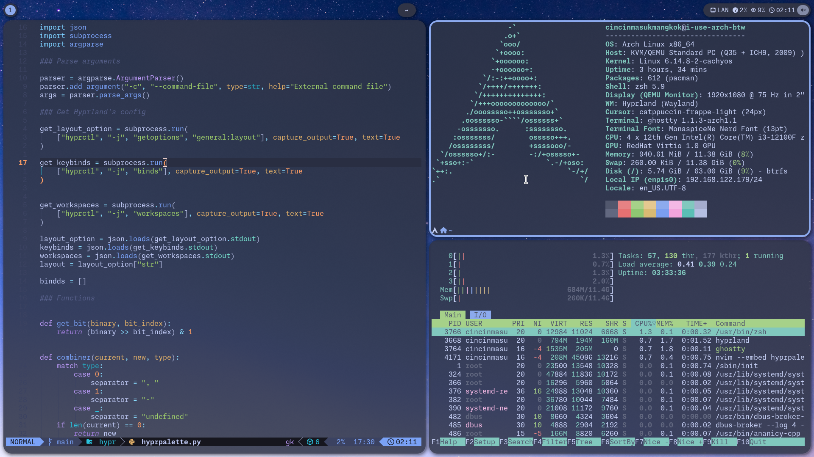

# Onigiri



## Installation

### Prerequisites

[Hyprland](https://hyprland.org/)\
[Waybar](https://github.com/Alexays/Waybar/)\
[rofi (lbonn's Wayland fork)](https://github.com/lbonn/rofi)\
[SwayNotificationCenter](https://github.com/ErikReider/SwayNotificationCenter)\
[Hyprpaper](https://github.com/hyprwm/hyprpaper)\
[Bash](https://www.gnu.org/software/bash/)\
[Git](https://git-scm.com/)\
[Zenity](https://gitlab.gnome.org/GNOME/zenity) \
Terminal emulator with Wayland support \
systemd-logind/elogind (Currently power actions only support logind) \
[PipeWire](https://pipewire.org/) & [WirePlumber](https://pipewire.pages.freedesktop.org/wireplumber/) (Currently volume control only support PipeWire & WirePlumber) \
[playerctl](https://github.com/altdesktop/playerctl) (For media control) \
[grim](https://gitlab.freedesktop.org/emersion/grim) (For taking screenshot) \
[slurp](https://github.com/emersion/slurp) (For taking screenshot of a region) \
[Monaspice Nerd Font](https://www.nerdfonts.com/)

#### Prerequisites installation
<details><summary>Arch Linux (with Ghostty terminal)</summary>

  ``` 
  # pacman -S hyprland waybar rofi-wayland swaync hyprpaper git zenity ghostty pipewire wireplumber playerctl grim slurp otf-monaspace-nerd
```

</details>

<details><summary>Ubuntu</summary>
Add Hyprland PPA for 24.04 & earlier

```
sudo add-apt-repository ppa:cppiber/hyprland
```

Add Ubuntu Sway Remix PPA for Rofi (Wayland fork)
```
sudo add-apt-repository ppa:ubuntusway-dev/stable
```

Install prerequisites (with kitty terminal)
```
sudo apt install hyprland waybar sway-notificaton-center rofi-wayland hyprpaper git zenity kitty playerctl grim slurp python3-psutil
```

Install fonts
```
mkdir ~/.fonts
cd ~/.fonts
curl -LO "https://github.com/ryanoasis/nerd-fonts/releases/download/v3.4.0/Monaspace.zip"
unzip Monaspace.zip
rm Monaspace.zip
```
</details>

### Installation
```
mkdir ~/.config
git clone --recursive https://gitlab.com/lepz0r/onigiri ~/.config/hypr
```

## Credits:
Default wallpaper: [Blue Night](https://stocksnap.io/photo/blue-night-DBUU6N5YUY) by [Free Nature Stock](https://stocksnap.io/author/freenaturestock) ([CC0](https://creativecommons.org/publicdomain/zero/1.0/))

### Configuration
Some settings can be configured through command palette (Super-Shift-P)
#### Hyprland
To add Hyprland configuration, put your additional configuration into a file in `~/.config/hypr/hyprland.conf.d/` 
<details><summary>Additional configuration example</summary>

```
# Change default terminal, by default use sensible-terminal script bundled with this dotfiles.
$terminal = alacritty

# Disable hardware cursors for NVIDIA GPU
cursor {
  no_hardware_cursors=false 
}

# Change cursor name & size 
$cursorName = catppuccin-macchiato-light-cursors
$cursorSize = 24
```

</details>
